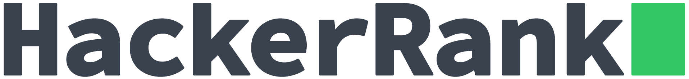

# MyHackerRankSolutions

   

	
   
  

   
  
  

Projeto criado para reforçar e desafiar os meus conhecimentos na linguagem C#.

# :star: Tabela de Conteúdo

* [Site do HackerRank](#site-do-hackerrank) 
* [Tecnologia](#tecnologia)
* [Licença](#licença)

# Site do HackerRank
Pratique programação, prepara-se para entrevistas, e seja contratado.
Você pode acessar o site em:  [https://www.hackerrank.com/](https://www.hackerrank.com/)

# Tecnologia
Todos os desafios realizados neste repositório, foi utilizado a linguagem de programação [C#](https://docs.microsoft.com/pt-br/dotnet/csharp/).

# Licença

Criado em 2020 

Feito com carinho por [Douglas Alves Marcelino](https://github.com/TheeDouglasAM3) :duck:
Esse projeto esta sobre [MIT license](./LICENSE).